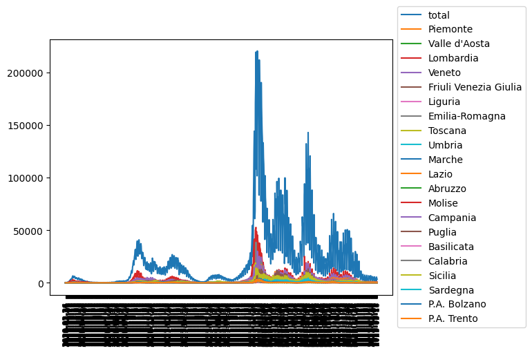

# Italy Covid-19

## Prediction

In this case I fit an normal distribution to new cases.\
I assume that 28th of march is peak day.

## Growth in each region
With this code you can draw new cases of covid-19 in Italy based on regions

We use data from [here](https://raw.githubusercontent.com/pcm-dpc/COVID-19/master/dati-json/dpc-covid19-ita-regioni.json)

[\#StayHome](https://www.google.com/search?client=firefox-b-d&q=%23stayhome)
[\#lorestocasa](https://www.google.com/search?client=firefox-b-d&q=%23lorestocasa)
[\#در_خانه_میمانیم](https://www.google.com/search?client=firefox-b-d&q=%23%D8%AF%D8%B1_%D8%AE%D8%A7%D9%86%D9%87_%D9%85%DB%8C%D9%85%D8%A7%D9%86%DB%8C%D9%85)
